# [📈 Live Status](https://volfclub.github.io/player2): <!--live status--> **🟧 Partial outage**

This repository contains the open-source uptime monitor and status page for [逊狼](volf.club), powered by [Upptime](https://github.com/upptime/upptime).

With [Upptime](https://upptime.js.org), you can get your own unlimited and free uptime monitor and status page, powered entirely by a GitHub repository. We use [Issues](https://github.com/volfclub/player2/issues) as incident reports, [Actions](https://github.com/volfclub/player2/actions) as uptime monitors, and [Pages](https://volfclub.github.io/player2) for the status page.

<!--start: status pages-->
<!-- This summary is generated by Upptime (https://github.com/upptime/upptime) -->
<!-- Do not edit this manually, your changes will be overwritten -->
<!-- prettier-ignore -->
| URL | Status | History | Response Time | Uptime |
| --- | ------ | ------- | ------------- | ------ |
|  [开往](https://github.com/volfclub/travelling) | 🟩 Up | [.yml](https://github.com/volfclub/travellings-status/commits/HEAD/history/.yml) | 

 2995ms
     
 | 

<a href="https://volfclub.github.io/travellings-status/history/">0.00%</a>
    

|  [狼牌工作网址导航](https://www.volf.club) | 🟩 Up | [.yml](https://github.com/volfclub/travellings-status/commits/HEAD/history/.yml) | 

 2995ms
     
 | 

<a href="https://volfclub.github.io/travellings-status/history/">0.00%</a>
    

|  [音速装机](https://sonic.volf.club) | 🟩 Up | [.yml](https://github.com/volfclub/travellings-status/commits/HEAD/history/.yml) | 

 2995ms
     
 | 

<a href="https://volfclub.github.io/travellings-status/history/">0.00%</a>
    

|  [原谅糖](https://yltang.cn) | 🟩 Up | [.yml](https://github.com/volfclub/travellings-status/commits/HEAD/history/.yml) | 

 2995ms
     
 | 

<a href="https://volfclub.github.io/travellings-status/history/">0.00%</a>
    

|  [Barkure](https://guguga.cn) | 🟩 Up | [barkure.yml](https://github.com/volfclub/travellings-status/commits/HEAD/history/barkure.yml) | 

 2304ms
     
 | 

<a href="https://volfclub.github.io/travellings-status/history/barkure">100.00%</a>
    

|  [Yamdr](https://www.yamdr.cn) | 🟥 Down | [yamdr.yml](https://github.com/volfclub/travellings-status/commits/HEAD/history/yamdr.yml) | 

 13276ms
     
 | 

<a href="https://volfclub.github.io/travellings-status/history/yamdr">99.12%</a>
    

|  [INSPI和他的](https://www.kanofans.com) | 🟩 Up | [inspi.yml](https://github.com/volfclub/travellings-status/commits/HEAD/history/inspi.yml) | 

 3988ms
     
 | 

<a href="https://volfclub.github.io/travellings-status/history/inspi">100.00%</a>
    

|  [Ryan Wang's Blog](https://ryanc.cc) | 🟩 Up | [ryan-wang-s-blog.yml](https://github.com/volfclub/travellings-status/commits/HEAD/history/ryan-wang-s-blog.yml) | 

 1192ms
     
 | 

<a href="https://volfclub.github.io/travellings-status/history/ryan-wang-s-blog">100.00%</a>
    

|  [Seija](https://seija.me) | 🟩 Up | [seija.yml](https://github.com/volfclub/travellings-status/commits/HEAD/history/seija.yml) | 

 2819ms
     
 | 

<a href="https://volfclub.github.io/travellings-status/history/seija">100.00%</a>
    

|  [致远博客](https://blog.uniartisan.com) | 🟩 Up | [.yml](https://github.com/volfclub/travellings-status/commits/HEAD/history/.yml) | 

 2995ms
     
 | 

<a href="https://volfclub.github.io/travellings-status/history/">0.00%</a>
    

|  [JQM's Site](https://jinqimu.xyz) | 🟩 Up | [jqm-s-site.yml](https://github.com/volfclub/travellings-status/commits/HEAD/history/jqm-s-site.yml) | 

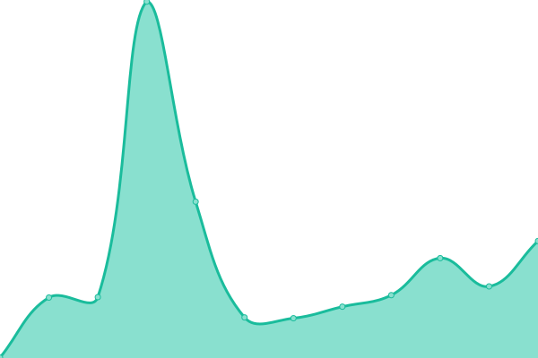 126ms
     
 | 

<a href="https://volfclub.github.io/travellings-status/history/jqm-s-site">100.00%</a>
    

|  [CrownDaisy](https://crowndaisy.com) | 🟩 Up | [crown-daisy.yml](https://github.com/volfclub/travellings-status/commits/HEAD/history/crown-daisy.yml) | 

 1206ms
     
 | 

<a href="https://volfclub.github.io/travellings-status/history/crown-daisy">100.00%</a>
    

|  [殆己](https://heycmm.cn) | 🟩 Up | [.yml](https://github.com/volfclub/travellings-status/commits/HEAD/history/.yml) | 

 2995ms
     
 | 

<a href="https://volfclub.github.io/travellings-status/history/">0.00%</a>
    

|  [Legroft](https://jinjis.cn) | 🟩 Up | [legroft.yml](https://github.com/volfclub/travellings-status/commits/HEAD/history/legroft.yml) | 

 8912ms
     
 | 

<a href="https://volfclub.github.io/travellings-status/history/legroft">100.00%</a>
    

|  [FANTASY](https://blog.tigerxly.com) | 🟩 Up | [fantasy.yml](https://github.com/volfclub/travellings-status/commits/HEAD/history/fantasy.yml) | 

 2137ms
     
 | 

<a href="https://volfclub.github.io/travellings-status/history/fantasy">100.00%</a>
    

|  [DIego's Blog](http://blog.diego.plus:5800) | 🟩 Up | [d-iego-s-blog.yml](https://github.com/volfclub/travellings-status/commits/HEAD/history/d-iego-s-blog.yml) | 

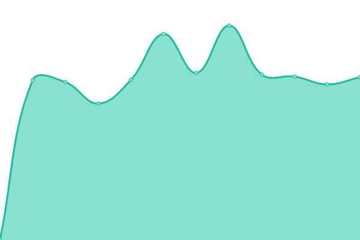 878ms
     
 | 

<a href="https://volfclub.github.io/travellings-status/history/d-iego-s-blog">100.00%</a>
    

|  [果子小酱](https://sublimerui.top) | 🟩 Up | [.yml](https://github.com/volfclub/travellings-status/commits/HEAD/history/.yml) | 

 2995ms
     
 | 

<a href="https://volfclub.github.io/travellings-status/history/">0.00%</a>
    

|  [Sakura](https://cwxyr.me) | 🟩 Up | [sakura.yml](https://github.com/volfclub/travellings-status/commits/HEAD/history/sakura.yml) | 

 1817ms
     
 | 

<a href="https://volfclub.github.io/travellings-status/history/sakura">100.00%</a>
    

|  [Muyulong's Blog](https://mmyyll.ml) | 🟩 Up | [muyulong-s-blog.yml](https://github.com/volfclub/travellings-status/commits/HEAD/history/muyulong-s-blog.yml) | 

 1983ms
     
 | 

<a href="https://volfclub.github.io/travellings-status/history/muyulong-s-blog">100.00%</a>
    

|  [五叶魔法书](https://grimoire.cn) | 🟩 Up | [.yml](https://github.com/volfclub/travellings-status/commits/HEAD/history/.yml) | 

 2995ms
     
 | 

<a href="https://volfclub.github.io/travellings-status/history/">0.00%</a>
    

|  [风渐远](https://www.naraku.cn) | 🟩 Up | [.yml](https://github.com/volfclub/travellings-status/commits/HEAD/history/.yml) | 

 2995ms
     
 | 

<a href="https://volfclub.github.io/travellings-status/history/">0.00%</a>
    

|  [XiYo吧](https://www.xiyo8.cn) | 🟩 Up | [xi-yo.yml](https://github.com/volfclub/travellings-status/commits/HEAD/history/xi-yo.yml) | 

 3751ms
     
 | 

<a href="https://volfclub.github.io/travellings-status/history/xi-yo">100.00%</a>
    

|  [锴](https://www.wangkai88.com) | 🟩 Up | [.yml](https://github.com/volfclub/travellings-status/commits/HEAD/history/.yml) | 

 2995ms
     
 | 

<a href="https://volfclub.github.io/travellings-status/history/">0.00%</a>
    

|  [Zeruns's Blog](https://blog.zeruns.tech) | 🟩 Up | [zeruns-s-blog.yml](https://github.com/volfclub/travellings-status/commits/HEAD/history/zeruns-s-blog.yml) | 

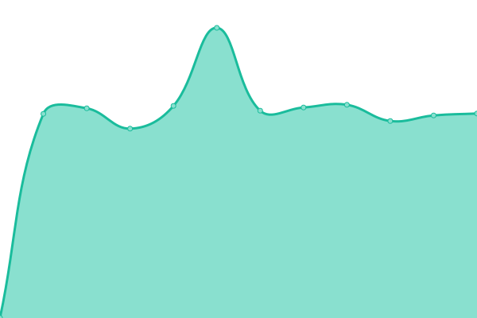 1921ms
     
 | 

<a href="https://volfclub.github.io/travellings-status/history/zeruns-s-blog">100.00%</a>
    

|  [Guqing's Blog](https://guqing.xyz) | 🟩 Up | [guqing-s-blog.yml](https://github.com/volfclub/travellings-status/commits/HEAD/history/guqing-s-blog.yml) | 

 1233ms
     
 | 

<a href="https://volfclub.github.io/travellings-status/history/guqing-s-blog">100.00%</a>
    

|  [lxxs的小屋](https://lxxs.xyz) | 🟩 Up | [lxxs.yml](https://github.com/volfclub/travellings-status/commits/HEAD/history/lxxs.yml) | 

 259ms
     
 | 

<a href="https://volfclub.github.io/travellings-status/history/lxxs">100.00%</a>
    

|  [非礼勿言](https://feiliwuyan.com) | 🟩 Up | [.yml](https://github.com/volfclub/travellings-status/commits/HEAD/history/.yml) | 

 2995ms
     
 | 

<a href="https://volfclub.github.io/travellings-status/history/">0.00%</a>
    

|  [星云C馆](https://www.m78.co) | 🟩 Up | [c.yml](https://github.com/volfclub/travellings-status/commits/HEAD/history/c.yml) | 

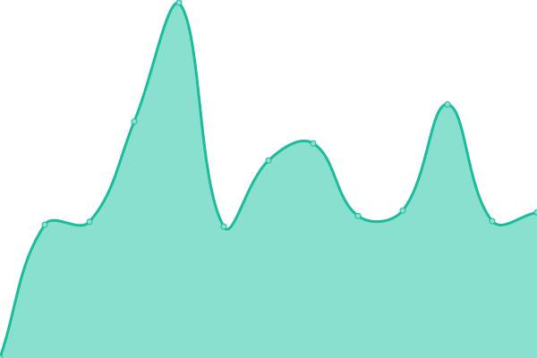 7656ms
     
 | 

<a href="https://volfclub.github.io/travellings-status/history/c">100.00%</a>
    

|  [雁陎的自耕地](https://www.sitstars.com) | 🟩 Up | [.yml](https://github.com/volfclub/travellings-status/commits/HEAD/history/.yml) | 

 2995ms
     
 | 

<a href="https://volfclub.github.io/travellings-status/history/">0.00%</a>
    

|  [阿猫阿狗](https://ionssource.cn) | 🟩 Up | [.yml](https://github.com/volfclub/travellings-status/commits/HEAD/history/.yml) | 

 2995ms
     
 | 

<a href="https://volfclub.github.io/travellings-status/history/">0.00%</a>
    

|  [风也温柔](https://blog.kaygb.com) | 🟩 Up | [.yml](https://github.com/volfclub/travellings-status/commits/HEAD/history/.yml) | 

 2995ms
     
 | 

<a href="https://volfclub.github.io/travellings-status/history/">0.00%</a>
    

|  [云游君的小站](https://www.yunyoujun.cn) | 🟩 Up | [.yml](https://github.com/volfclub/travellings-status/commits/HEAD/history/.yml) | 

 2995ms
     
 | 

<a href="https://volfclub.github.io/travellings-status/history/">0.00%</a>
    

|  [Mr.Chrosing`s Home](https://nasity.cn) | 🟩 Up | [mr-chrosing-s-home.yml](https://github.com/volfclub/travellings-status/commits/HEAD/history/mr-chrosing-s-home.yml) | 

 708ms
     
 | 

<a href="https://volfclub.github.io/travellings-status/history/mr-chrosing-s-home">100.00%</a>
    

|  [Eltrac's Track](https://blog.guhub.cn) | 🟩 Up | [eltrac-s-track.yml](https://github.com/volfclub/travellings-status/commits/HEAD/history/eltrac-s-track.yml) | 

 708ms
     
 | 

<a href="https://volfclub.github.io/travellings-status/history/eltrac-s-track">100.00%</a>
    

|  [yuaneuro的博客](https://yuaneuro.cn) | 🟩 Up | [yuaneuro.yml](https://github.com/volfclub/travellings-status/commits/HEAD/history/yuaneuro.yml) | 

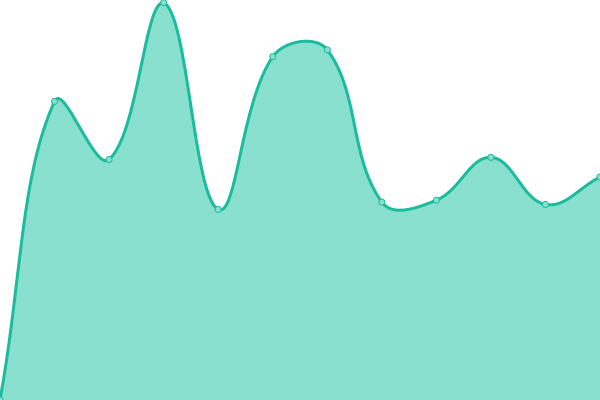 4055ms
     
 | 

<a href="https://volfclub.github.io/travellings-status/history/yuaneuro">100.00%</a>
    

|  [krau'blog](https://krau.top) | 🟩 Up | [krau-blog.yml](https://github.com/volfclub/travellings-status/commits/HEAD/history/krau-blog.yml) | 

 2005ms
     
 | 

<a href="https://volfclub.github.io/travellings-status/history/krau-blog">100.00%</a>
    

|  [风吟](https://blog.yilon.top) | 🟩 Up | [.yml](https://github.com/volfclub/travellings-status/commits/HEAD/history/.yml) | 

 2995ms
     
 | 

<a href="https://volfclub.github.io/travellings-status/history/">0.00%</a>
    

|  [freejishu的美丽世界](https://www.freejishu.com) | 🟩 Up | [freejishu.yml](https://github.com/volfclub/travellings-status/commits/HEAD/history/freejishu.yml) | 

 5678ms
     
 | 

<a href="https://volfclub.github.io/travellings-status/history/freejishu">100.00%</a>
    

|  [小太の游乐园](https://blog.713.moe) | 🟩 Up | [.yml](https://github.com/volfclub/travellings-status/commits/HEAD/history/.yml) | 

 2995ms
     
 | 

<a href="https://volfclub.github.io/travellings-status/history/">0.00%</a>
    

|  [Zhou‘s Blog](https://zhoublog.xyz) | 🟩 Up | [zhou-s-blog.yml](https://github.com/volfclub/travellings-status/commits/HEAD/history/zhou-s-blog.yml) | 

 4755ms
     
 | 

<a href="https://volfclub.github.io/travellings-status/history/zhou-s-blog">100.00%</a>
    

|  [地皮-DefiedParty](https://dpii.club) | 🟩 Up | [defied-party.yml](https://github.com/volfclub/travellings-status/commits/HEAD/history/defied-party.yml) | 

 2466ms
     
 | 

<a href="https://volfclub.github.io/travellings-status/history/defied-party">100.00%</a>
    

|  [CORE](https://core.moe) | 🟩 Up | [core.yml](https://github.com/volfclub/travellings-status/commits/HEAD/history/core.yml) | 

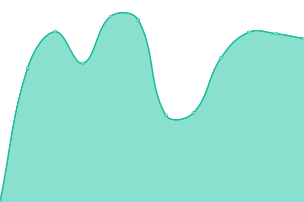 621ms
     
 | 

<a href="https://volfclub.github.io/travellings-status/history/core">100.00%</a>
    

|  [solar'blog](https://www.solarme.vip) | 🟩 Up | [solar-blog.yml](https://github.com/volfclub/travellings-status/commits/HEAD/history/solar-blog.yml) | 

 12722ms
     
 | 

<a href="https://volfclub.github.io/travellings-status/history/solar-blog">100.00%</a>
    

|  [SpinTouch's Something](https://spblog.tk) | 🟥 Down | [spin-touch-s-something.yml](https://github.com/volfclub/travellings-status/commits/HEAD/history/spin-touch-s-something.yml) | 

 0ms
     
 | 

<a href="https://volfclub.github.io/travellings-status/history/spin-touch-s-something">0.06%</a>
    

|  [Lin. 's Blog](https://www.lin03.cn) | 🟥 Down | [lin-s-blog.yml](https://github.com/volfclub/travellings-status/commits/HEAD/history/lin-s-blog.yml) | 

 0ms
     
 | 

<a href="https://volfclub.github.io/travellings-status/history/lin-s-blog">0.06%</a>
    

|  [TigerRoot](https://blog.tigerroot.cn) | 🟩 Up | [tiger-root.yml](https://github.com/volfclub/travellings-status/commits/HEAD/history/tiger-root.yml) | 

 8435ms
     
 | 

<a href="https://volfclub.github.io/travellings-status/history/tiger-root">100.00%</a>
    

|  [蝶恋花](https://kylin.dev) | 🟩 Up | [.yml](https://github.com/volfclub/travellings-status/commits/HEAD/history/.yml) | 

 2995ms
     
 | 

<a href="https://volfclub.github.io/travellings-status/history/">0.00%</a>
    

|  [摸鱼堂](blog.moefishtang.xyz) | 🟩 Up | [.yml](https://github.com/volfclub/travellings-status/commits/HEAD/history/.yml) | 

 2995ms
     
 | 

<a href="https://volfclub.github.io/travellings-status/history/">0.00%</a>
    

|  [Pluveto](https://www.pluvet.com) | 🟩 Up | [pluveto.yml](https://github.com/volfclub/travellings-status/commits/HEAD/history/pluveto.yml) | 

 2690ms
     
 | 

<a href="https://volfclub.github.io/travellings-status/history/pluveto">100.00%</a>
    

|  [艺术长廊](https://www.6zgm.com) | 🟩 Up | [.yml](https://github.com/volfclub/travellings-status/commits/HEAD/history/.yml) | 

 2995ms
     
 | 

<a href="https://volfclub.github.io/travellings-status/history/">0.00%</a>
    

|  [LifeAlsoIsGG's blog](https://blog.lifeisgg.online) | 🟥 Down | [life-also-is-gg-s-blog.yml](https://github.com/volfclub/travellings-status/commits/HEAD/history/life-also-is-gg-s-blog.yml) | 

 0ms
     
 | 

<a href="https://volfclub.github.io/travellings-status/history/life-also-is-gg-s-blog">0.03%</a>
    

|  [Ojhdt's Blog](https://blog.ojhdt.com) | 🟩 Up | [ojhdt-s-blog.yml](https://github.com/volfclub/travellings-status/commits/HEAD/history/ojhdt-s-blog.yml) | 

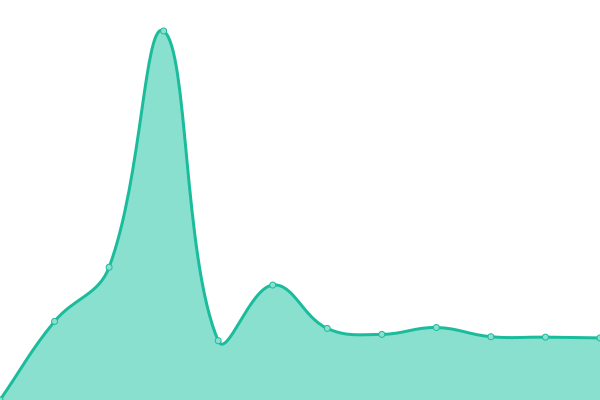 2018ms
     
 | 

<a href="https://volfclub.github.io/travellings-status/history/ojhdt-s-blog">100.00%</a>
    

|  [萌豚 Moechu](https://moechu.cn) | 🟩 Up | [moechu.yml](https://github.com/volfclub/travellings-status/commits/HEAD/history/moechu.yml) | 

 2960ms
     
 | 

<a href="https://volfclub.github.io/travellings-status/history/moechu">100.00%</a>
    

|  [ncc的个人网站](https://www.zqcnc.cn) | 🟩 Up | [ncc.yml](https://github.com/volfclub/travellings-status/commits/HEAD/history/ncc.yml) | 

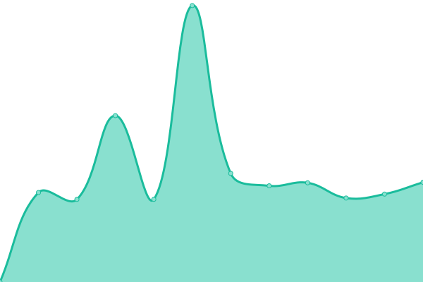 2222ms
     
 | 

<a href="https://volfclub.github.io/travellings-status/history/ncc">100.00%</a>
    

|  [刀客](https://blog.mboker.cn) | 🟩 Up | [.yml](https://github.com/volfclub/travellings-status/commits/HEAD/history/.yml) | 

 2995ms
     
 | 

<a href="https://volfclub.github.io/travellings-status/history/">0.00%</a>
    

|  [静静的小窝](https://wznmickey.com) | 🟩 Up | [.yml](https://github.com/volfclub/travellings-status/commits/HEAD/history/.yml) | 

 2995ms
     
 | 

<a href="https://volfclub.github.io/travellings-status/history/">0.00%</a>
    

|  [及时行乐](https://www.jsxlo.com) | 🟩 Up | [.yml](https://github.com/volfclub/travellings-status/commits/HEAD/history/.yml) | 

 2995ms
     
 | 

<a href="https://volfclub.github.io/travellings-status/history/">0.00%</a>
    

|  [iSwl's Blog](https://blog.iswl.vip) | 🟩 Up | [i-swl-s-blog.yml](https://github.com/volfclub/travellings-status/commits/HEAD/history/i-swl-s-blog.yml) | 

 2560ms
     
 | 

<a href="https://volfclub.github.io/travellings-status/history/i-swl-s-blog">100.00%</a>
    

|  [魏巍](https://paperbox.xyz) | 🟩 Up | [.yml](https://github.com/volfclub/travellings-status/commits/HEAD/history/.yml) | 

 2995ms
     
 | 

<a href="https://volfclub.github.io/travellings-status/history/">0.00%</a>
    

|  [Leo’s Blog](https://www.isolitude.cn) | 🟥 Down | [leo-s-blog.yml](https://github.com/volfclub/travellings-status/commits/HEAD/history/leo-s-blog.yml) | 

 3147ms
     
 | 

<a href="https://volfclub.github.io/travellings-status/history/leo-s-blog">0.24%</a>
    

|  [顾盼の记事本](https://gupan.site) | 🟩 Up | [.yml](https://github.com/volfclub/travellings-status/commits/HEAD/history/.yml) | 

 2995ms
     
 | 

<a href="https://volfclub.github.io/travellings-status/history/">0.00%</a>
    

|  [爆胎的博客](https://www.itggg.cn) | 🟩 Up | [.yml](https://github.com/volfclub/travellings-status/commits/HEAD/history/.yml) | 

 2995ms
     
 | 

<a href="https://volfclub.github.io/travellings-status/history/">0.00%</a>
    

|  [花开陌上](https://moshanghua.net) | 🟩 Up | [.yml](https://github.com/volfclub/travellings-status/commits/HEAD/history/.yml) | 

 2995ms
     
 | 

<a href="https://volfclub.github.io/travellings-status/history/">0.00%</a>
    

|  [炎忍的博客](https://blog.endureblaze.cn) | 🟩 Up | [.yml](https://github.com/volfclub/travellings-status/commits/HEAD/history/.yml) | 

 2995ms
     
 | 

<a href="https://volfclub.github.io/travellings-status/history/">0.00%</a>
    

|  [青行三の个人博客](https://blog.jiehua1995.xyz) | 🟩 Up | [.yml](https://github.com/volfclub/travellings-status/commits/HEAD/history/.yml) | 

 2995ms
     
 | 

<a href="https://volfclub.github.io/travellings-status/history/">0.00%</a>
    

|  [有次博客](https://you.ci) | 🟩 Up | [.yml](https://github.com/volfclub/travellings-status/commits/HEAD/history/.yml) | 

 2995ms
     
 | 

<a href="https://volfclub.github.io/travellings-status/history/">0.00%</a>
    

|  [SkyWT](https://skywt.cn) | 🟩 Up | [sky-wt.yml](https://github.com/volfclub/travellings-status/commits/HEAD/history/sky-wt.yml) | 

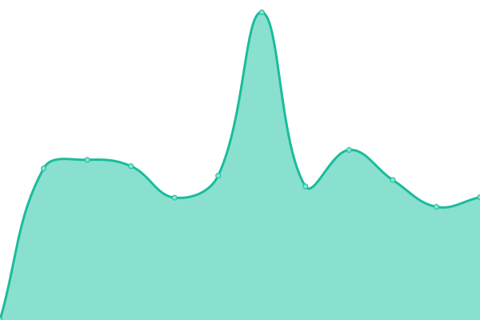 4048ms
     
 | 

<a href="https://volfclub.github.io/travellings-status/history/sky-wt">100.00%</a>
    

|  [执手对影成双](https://www.lipk.org) | 🟩 Up | [.yml](https://github.com/volfclub/travellings-status/commits/HEAD/history/.yml) | 

 2995ms
     
 | 

<a href="https://volfclub.github.io/travellings-status/history/">0.00%</a>
    

|  [MySpace](https://www.zkl2333.com) | 🟩 Up | [my-space.yml](https://github.com/volfclub/travellings-status/commits/HEAD/history/my-space.yml) | 

 2359ms
     
 | 

<a href="https://volfclub.github.io/travellings-status/history/my-space">100.00%</a>
    

|  [皮毛技术君](https://www.whoit.top) | 🟩 Up | [.yml](https://github.com/volfclub/travellings-status/commits/HEAD/history/.yml) | 

 2995ms
     
 | 

<a href="https://volfclub.github.io/travellings-status/history/">0.00%</a>
    

|  [Passer](https://takuron.top) | 🟩 Up | [passer.yml](https://github.com/volfclub/travellings-status/commits/HEAD/history/passer.yml) | 

 1198ms
     
 | 

<a href="https://volfclub.github.io/travellings-status/history/passer">100.00%</a>
    

|  [沐森西の博客](https://dlizi.com) | 🟩 Up | [.yml](https://github.com/volfclub/travellings-status/commits/HEAD/history/.yml) | 

 2995ms
     
 | 

<a href="https://volfclub.github.io/travellings-status/history/">0.00%</a>
    

|  [山葵酱](https://www.wasabi.fun) | 🟩 Up | [.yml](https://github.com/volfclub/travellings-status/commits/HEAD/history/.yml) | 

 2995ms
     
 | 

<a href="https://volfclub.github.io/travellings-status/history/">0.00%</a>
    

|  [Ying](https://yingserver.cn) | 🟩 Up | [ying.yml](https://github.com/volfclub/travellings-status/commits/HEAD/history/ying.yml) | 

 8975ms
     
 | 

<a href="https://volfclub.github.io/travellings-status/history/ying">100.00%</a>
    

|  [风之暇想](https://www.fzxx.xyz) | 🟩 Up | [.yml](https://github.com/volfclub/travellings-status/commits/HEAD/history/.yml) | 

 2995ms
     
 | 

<a href="https://volfclub.github.io/travellings-status/history/">0.00%</a>
    

|  [今今今生](https://noheart.cn) | 🟩 Up | [.yml](https://github.com/volfclub/travellings-status/commits/HEAD/history/.yml) | 

 2995ms
     
 | 

<a href="https://volfclub.github.io/travellings-status/history/">0.00%</a>
    

|  [ADD-SP‘s Blog](https://www.addesp.com) | 🟩 Up | [add-sp-s-blog.yml](https://github.com/volfclub/travellings-status/commits/HEAD/history/add-sp-s-blog.yml) | 

 2099ms
     
 | 

<a href="https://volfclub.github.io/travellings-status/history/add-sp-s-blog">100.00%</a>
    

|  [游轶的小站](https://blog.devyi.com) | 🟩 Up | [.yml](https://github.com/volfclub/travellings-status/commits/HEAD/history/.yml) | 

 2995ms
     
 | 

<a href="https://volfclub.github.io/travellings-status/history/">0.00%</a>
    

|  [MHuiG's Blog](https://blog.mhuig.top) | 🟩 Up | [m-hui-g-s-blog.yml](https://github.com/volfclub/travellings-status/commits/HEAD/history/m-hui-g-s-blog.yml) | 

 489ms
     
 | 

<a href="https://volfclub.github.io/travellings-status/history/m-hui-g-s-blog">100.00%</a>
    

|  [JalenChuh](https://blog.jalenchuh.cn) | 🟩 Up | [jalen-chuh.yml](https://github.com/volfclub/travellings-status/commits/HEAD/history/jalen-chuh.yml) | 

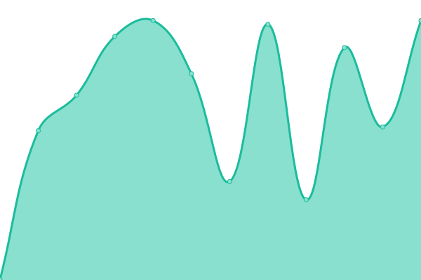 417ms
     
 | 

<a href="https://volfclub.github.io/travellings-status/history/jalen-chuh">100.00%</a>
    

|  [LiuYun](https://blog.6yfz.cn) | 🟩 Up | [liu-yun.yml](https://github.com/volfclub/travellings-status/commits/HEAD/history/liu-yun.yml) | 

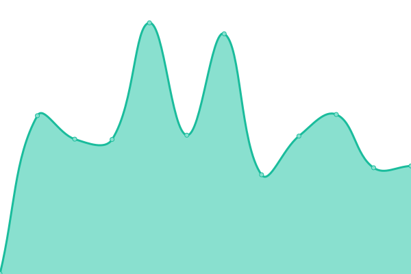 345ms
     
 | 

<a href="https://volfclub.github.io/travellings-status/history/liu-yun">100.00%</a>
    

|  [Geek Era](https://www.geekera.cn) | 🟩 Up | [geek-era.yml](https://github.com/volfclub/travellings-status/commits/HEAD/history/geek-era.yml) | 

 5636ms
     
 | 

<a href="https://volfclub.github.io/travellings-status/history/geek-era">100.00%</a>
    

|  [Oo笑容太甜oO](https://kissbaofish.cn) | 🟩 Up | [oo-o-o.yml](https://github.com/volfclub/travellings-status/commits/HEAD/history/oo-o-o.yml) | 

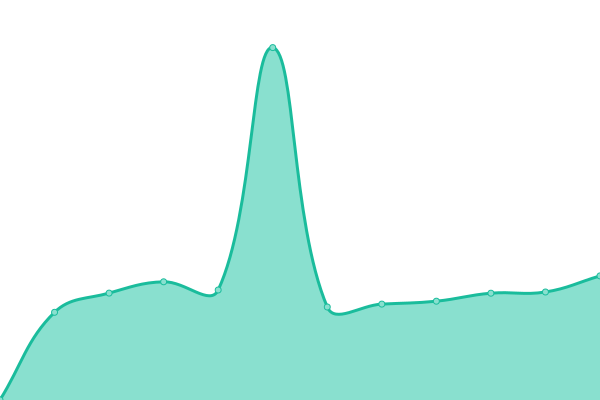 1427ms
     
 | 

<a href="https://volfclub.github.io/travellings-status/history/oo-o-o">100.00%</a>
    

|  [F君的博客](https://blog.fkun.tech) | 🟩 Up | [f.yml](https://github.com/volfclub/travellings-status/commits/HEAD/history/f.yml) | 

 1090ms
     
 | 

<a href="https://volfclub.github.io/travellings-status/history/f">100.00%</a>
    

|  [The Palace](https://seiryu.cn) | 🟩 Up | [the-palace.yml](https://github.com/volfclub/travellings-status/commits/HEAD/history/the-palace.yml) | 

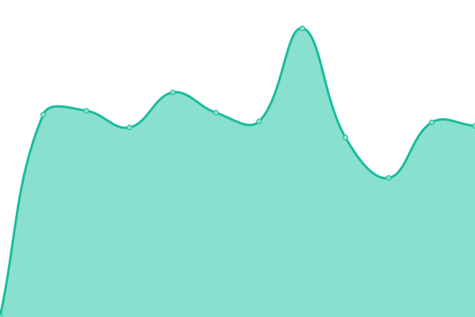 11835ms
     
 | 

<a href="https://volfclub.github.io/travellings-status/history/the-palace">100.00%</a>
    

|  [Chr_小屋](https://blog.chrxw.com) | 🟩 Up | [chr.yml](https://github.com/volfclub/travellings-status/commits/HEAD/history/chr.yml) | 

 793ms
     
 | 

<a href="https://volfclub.github.io/travellings-status/history/chr">100.00%</a>
    

|  [tabris的遥远星系](https://www.tabirstrees.top) | 🟩 Up | [tabris.yml](https://github.com/volfclub/travellings-status/commits/HEAD/history/tabris.yml) | 

 870ms
     
 | 

<a href="https://volfclub.github.io/travellings-status/history/tabris">100.00%</a>
    

|  [728004090博客](https://www.googlessr.top) | 🟥 Down | [728004090.yml](https://github.com/volfclub/travellings-status/commits/HEAD/history/728004090.yml) | 

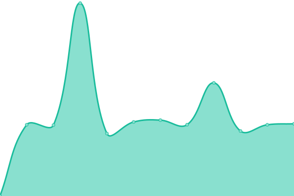 4276ms
     
 | 

<a href="https://volfclub.github.io/travellings-status/history/728004090">0.31%</a>
    

|  [服务猿's 学习笔记](https://www.ishells.cn) | 🟩 Up | [s.yml](https://github.com/volfclub/travellings-status/commits/HEAD/history/s.yml) | 

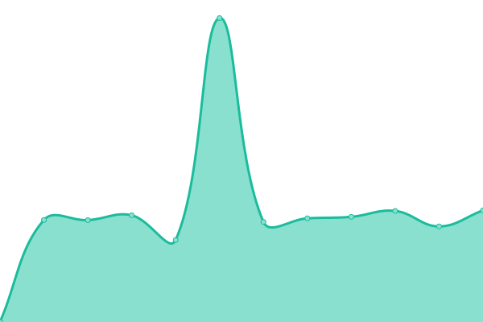 1466ms
     
 | 

<a href="https://volfclub.github.io/travellings-status/history/s">100.00%</a>
    

|  [尼采般地抒情](https://www.wztlink1013.com) | 🟩 Up | [.yml](https://github.com/volfclub/travellings-status/commits/HEAD/history/.yml) | 

 2995ms
     
 | 

<a href="https://volfclub.github.io/travellings-status/history/">0.00%</a>
    

|  [Zkpeace](https://zkpeace.com) | 🟩 Up | [zkpeace.yml](https://github.com/volfclub/travellings-status/commits/HEAD/history/zkpeace.yml) | 

 593ms
     
 | 

<a href="https://volfclub.github.io/travellings-status/history/zkpeace">100.00%</a>
    

|  [低调小熊猫](http://ilovey.live) | 🟩 Up | [.yml](https://github.com/volfclub/travellings-status/commits/HEAD/history/.yml) | 

 2995ms
     
 | 

<a href="https://volfclub.github.io/travellings-status/history/">0.00%</a>
    

|  [Guang's blog](https://code016.com) | 🟩 Up | [guang-s-blog.yml](https://github.com/volfclub/travellings-status/commits/HEAD/history/guang-s-blog.yml) | 

 2647ms
     
 | 

<a href="https://volfclub.github.io/travellings-status/history/guang-s-blog">100.00%</a>
    

|  [挨拍的儿](https://jimmyqin.cn) | 🟩 Up | [.yml](https://github.com/volfclub/travellings-status/commits/HEAD/history/.yml) | 

 2995ms
     
 | 

<a href="https://volfclub.github.io/travellings-status/history/">0.00%</a>
    

|  [莫逡巡的博客](https://wangpl.top) | 🟩 Up | [.yml](https://github.com/volfclub/travellings-status/commits/HEAD/history/.yml) | 

 2995ms
     
 | 

<a href="https://volfclub.github.io/travellings-status/history/">0.00%</a>
    

|  [三路清风](https://www.yansanlu.com) | 🟩 Up | [.yml](https://github.com/volfclub/travellings-status/commits/HEAD/history/.yml) | 

 2995ms
     
 | 

<a href="https://volfclub.github.io/travellings-status/history/">0.00%</a>
    

|  [房东的猫](https://www.fddmao.com) | 🟩 Up | [.yml](https://github.com/volfclub/travellings-status/commits/HEAD/history/.yml) | 

 2995ms
     
 | 

<a href="https://volfclub.github.io/travellings-status/history/">0.00%</a>
    

|  [七米蓝](https://www.chirmyram.top) | 🟩 Up | [.yml](https://github.com/volfclub/travellings-status/commits/HEAD/history/.yml) | 

 2995ms
     
 | 

<a href="https://volfclub.github.io/travellings-status/history/">0.00%</a>
    

|  [旧叙新陈'Blog](https://jiuxuxinchen.xyz) | 🟩 Up | [blog.yml](https://github.com/volfclub/travellings-status/commits/HEAD/history/blog.yml) | 

 7073ms
     
 | 

<a href="https://volfclub.github.io/travellings-status/history/blog">100.00%</a>
    

|  [MZRME‘S](https://mzrme.com) | 🟩 Up | [mzrme-s.yml](https://github.com/volfclub/travellings-status/commits/HEAD/history/mzrme-s.yml) | 

 594ms
     
 | 

<a href="https://volfclub.github.io/travellings-status/history/mzrme-s">100.00%</a>
    

|  [归舟棹远](https://www.tanknee.cn) | 🟩 Up | [.yml](https://github.com/volfclub/travellings-status/commits/HEAD/history/.yml) | 

 2995ms
     
 | 

<a href="https://volfclub.github.io/travellings-status/history/">0.00%</a>
    

|  [人家故里](https://fx7.top) | 🟩 Up | [.yml](https://github.com/volfclub/travellings-status/commits/HEAD/history/.yml) | 

 2995ms
     
 | 

<a href="https://volfclub.github.io/travellings-status/history/">0.00%</a>
    

|  [丁丁の店](https://blog.butanediol.me) | 🟩 Up | [.yml](https://github.com/volfclub/travellings-status/commits/HEAD/history/.yml) | 

 2995ms
     
 | 

<a href="https://volfclub.github.io/travellings-status/history/">0.00%</a>
    

|  [饿龙不是龙哩](https://loafing.cn) | 🟩 Up | [.yml](https://github.com/volfclub/travellings-status/commits/HEAD/history/.yml) | 

 2995ms
     
 | 

<a href="https://volfclub.github.io/travellings-status/history/">0.00%</a>
    

|  [低调阁](https://www.ddg.ink) | 🟩 Up | [.yml](https://github.com/volfclub/travellings-status/commits/HEAD/history/.yml) | 

 2995ms
     
 | 

<a href="https://volfclub.github.io/travellings-status/history/">0.00%</a>
    

|  [SWJ](https://blog.zggsong.cn) | 🟩 Up | [swj.yml](https://github.com/volfclub/travellings-status/commits/HEAD/history/swj.yml) | 

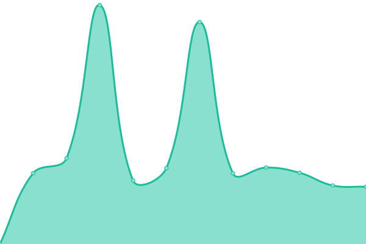 6281ms
     
 | 

<a href="https://volfclub.github.io/travellings-status/history/swj">100.00%</a>
    

|  [Sanarous's Blog](https://bestzuo.cn) | 🟩 Up | [sanarous-s-blog.yml](https://github.com/volfclub/travellings-status/commits/HEAD/history/sanarous-s-blog.yml) | 

 8488ms
     
 | 

<a href="https://volfclub.github.io/travellings-status/history/sanarous-s-blog">100.00%</a>
    

|  [HandSonic‘s Blog](https://handsonic.top) | 🟩 Up | [hand-sonic-s-blog.yml](https://github.com/volfclub/travellings-status/commits/HEAD/history/hand-sonic-s-blog.yml) | 

 4101ms
     
 | 

<a href="https://volfclub.github.io/travellings-status/history/hand-sonic-s-blog">100.00%</a>
    

|  [雾漫江南](https://oxoch.com) | 🟩 Up | [.yml](https://github.com/volfclub/travellings-status/commits/HEAD/history/.yml) | 

 2995ms
     
 | 

<a href="https://volfclub.github.io/travellings-status/history/">0.00%</a>
    

|  [Sorryfu](https://fushaolei.github.io) | 🟩 Up | [sorryfu.yml](https://github.com/volfclub/travellings-status/commits/HEAD/history/sorryfu.yml) | 

 80ms
     
 | 

<a href="https://volfclub.github.io/travellings-status/history/sorryfu">100.00%</a>
    

|  [静かな森](https://innei.ren) | 🟩 Up | [.yml](https://github.com/volfclub/travellings-status/commits/HEAD/history/.yml) | 

 2995ms
     
 | 

<a href="https://volfclub.github.io/travellings-status/history/">0.00%</a>
    

|  [杜老师说](https://dusays.com) | 🟩 Up | [.yml](https://github.com/volfclub/travellings-status/commits/HEAD/history/.yml) | 

 2995ms
     
 | 

<a href="https://volfclub.github.io/travellings-status/history/">0.00%</a>
    

|  [独人欣赏](https://www.wangyusong.cn) | 🟩 Up | [.yml](https://github.com/volfclub/travellings-status/commits/HEAD/history/.yml) | 

 2995ms
     
 | 

<a href="https://volfclub.github.io/travellings-status/history/">0.00%</a>
    

|  [zcmimi's blog](https://blog.zcmimi.top) | 🟩 Up | [zcmimi-s-blog.yml](https://github.com/volfclub/travellings-status/commits/HEAD/history/zcmimi-s-blog.yml) | 

 483ms
     
 | 

<a href="https://volfclub.github.io/travellings-status/history/zcmimi-s-blog">100.00%</a>
    

|  [TF的博客](https://blog.tengfei.website) | 🟩 Up | [tf.yml](https://github.com/volfclub/travellings-status/commits/HEAD/history/tf.yml) | 

 1556ms
     
 | 

<a href="https://volfclub.github.io/travellings-status/history/tf">100.00%</a>
    

|  [简兮小站](https://www.zk1220.com) | 🟩 Up | [.yml](https://github.com/volfclub/travellings-status/commits/HEAD/history/.yml) | 

 2995ms
     
 | 

<a href="https://volfclub.github.io/travellings-status/history/">0.00%</a>
    

|  [Colsrch'Blog](https://colsrch.cn) | 🟩 Up | [colsrch-blog.yml](https://github.com/volfclub/travellings-status/commits/HEAD/history/colsrch-blog.yml) | 

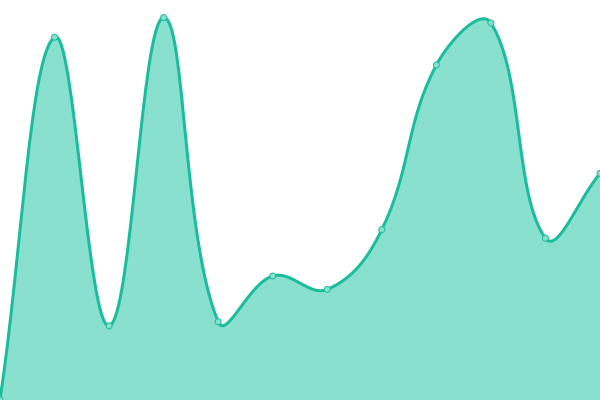 1097ms
     
 | 

<a href="https://volfclub.github.io/travellings-status/history/colsrch-blog">100.00%</a>
    

|  [AzuSemisa's Blog](https://azusemisa.top) | 🟩 Up | [azu-semisa-s-blog.yml](https://github.com/volfclub/travellings-status/commits/HEAD/history/azu-semisa-s-blog.yml) | 

 2466ms
     
 | 

<a href="https://volfclub.github.io/travellings-status/history/azu-semisa-s-blog">100.00%</a>
    

|  [倚栏听风](https://www.yilantingfeng.site) | 🟩 Up | [.yml](https://github.com/volfclub/travellings-status/commits/HEAD/history/.yml) | 

 2995ms
     
 | 

<a href="https://volfclub.github.io/travellings-status/history/">0.00%</a>
    

|  [Xu's Blog](https://hasaik.com) | 🟩 Up | [xu-s-blog.yml](https://github.com/volfclub/travellings-status/commits/HEAD/history/xu-s-blog.yml) | 

 1997ms
     
 | 

<a href="https://volfclub.github.io/travellings-status/history/xu-s-blog">100.00%</a>
    

|  [優萌初華](https://shoka.lostyu.me) | 🟩 Up | [.yml](https://github.com/volfclub/travellings-status/commits/HEAD/history/.yml) | 

 2995ms
     
 | 

<a href="https://volfclub.github.io/travellings-status/history/">0.00%</a>
    

|  [MES](https://rain.moimo.me) | 🟩 Up | [mes.yml](https://github.com/volfclub/travellings-status/commits/HEAD/history/mes.yml) | 

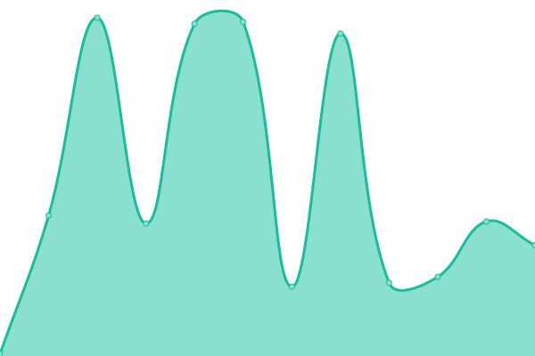 55ms
     
 | 

<a href="https://volfclub.github.io/travellings-status/history/mes">100.00%</a>
    

|  [ZigZagK的博客](https://zigzagk.top) | 🟩 Up | [zig-zag-k.yml](https://github.com/volfclub/travellings-status/commits/HEAD/history/zig-zag-k.yml) | 

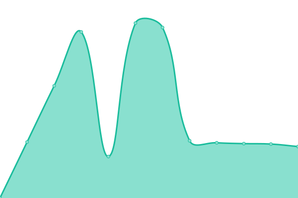 6279ms
     
 | 

<a href="https://volfclub.github.io/travellings-status/history/zig-zag-k">100.00%</a>
    

|  [SkYe's Blog](https://www.mrskye.cn) | 🟩 Up | [sk-ye-s-blog.yml](https://github.com/volfclub/travellings-status/commits/HEAD/history/sk-ye-s-blog.yml) | 

 2918ms
     
 | 

<a href="https://volfclub.github.io/travellings-status/history/sk-ye-s-blog">100.00%</a>
    

|  [JsOnGmAX-博客](https://jsong.cn) | 🟩 Up | [js-on-gm-ax.yml](https://github.com/volfclub/travellings-status/commits/HEAD/history/js-on-gm-ax.yml) | 

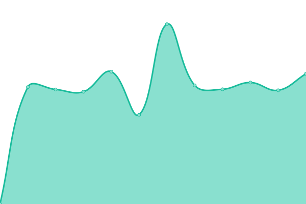 7302ms
     
 | 

<a href="https://volfclub.github.io/travellings-status/history/js-on-gm-ax">100.00%</a>
    

|  [Kiritoghy's Blog](https://www.kiritoghy.cn) | 🟩 Up | [kiritoghy-s-blog.yml](https://github.com/volfclub/travellings-status/commits/HEAD/history/kiritoghy-s-blog.yml) | 

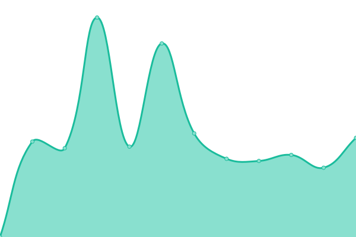 3470ms
     
 | 

<a href="https://volfclub.github.io/travellings-status/history/kiritoghy-s-blog">100.00%</a>
    

|  [BORBER](https://www.cnblogs.com/borber) | 🟩 Up | [borber.yml](https://github.com/volfclub/travellings-status/commits/HEAD/history/borber.yml) | 

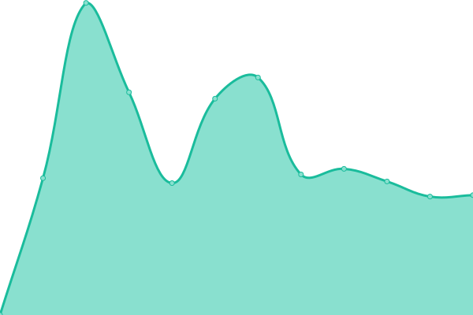 4108ms
     
 | 

<a href="https://volfclub.github.io/travellings-status/history/borber">100.00%</a>
    

|  [NEROASMAR.TOP](https://neroasmar.top) | 🟩 Up | [neroasmar-top.yml](https://github.com/volfclub/travellings-status/commits/HEAD/history/neroasmar-top.yml) | 

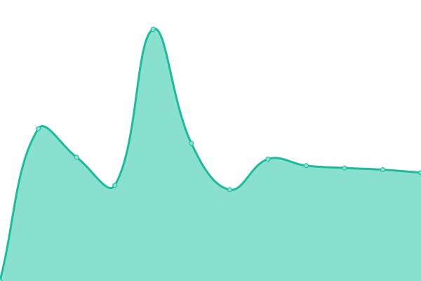 1762ms
     
 | 

<a href="https://volfclub.github.io/travellings-status/history/neroasmar-top">100.00%</a>
    

|  [若非](https://loafing.cn) | 🟩 Up | [.yml](https://github.com/volfclub/travellings-status/commits/HEAD/history/.yml) | 

 2995ms
     
 | 

<a href="https://volfclub.github.io/travellings-status/history/">0.00%</a>
    

|  [若非](https://loafing.cn) | 🟩 Up | [.yml](https://github.com/volfclub/travellings-status/commits/HEAD/history/.yml) | 

 2995ms
     
 | 

<a href="https://volfclub.github.io/travellings-status/history/">0.00%</a>
    

|  [弥枳](https://blog.coor.top) | 🟩 Up | [.yml](https://github.com/volfclub/travellings-status/commits/HEAD/history/.yml) | 

 2995ms
     
 | 

<a href="https://volfclub.github.io/travellings-status/history/">0.00%</a>
    

|  [不淡定的实验室](https://xd.sh.cn) | 🟩 Up | [.yml](https://github.com/volfclub/travellings-status/commits/HEAD/history/.yml) | 

 2995ms
     
 | 

<a href="https://volfclub.github.io/travellings-status/history/">0.00%</a>
    

|  [Micah](https://realmicah.xyz) | 🟩 Up | [micah.yml](https://github.com/volfclub/travellings-status/commits/HEAD/history/micah.yml) | 

 5444ms
     
 | 

<a href="https://volfclub.github.io/travellings-status/history/micah">100.00%</a>
    

|  [提莫酱的博客](https://zzr3.xyz) | 🟩 Up | [.yml](https://github.com/volfclub/travellings-status/commits/HEAD/history/.yml) | 

 2995ms
     
 | 

<a href="https://volfclub.github.io/travellings-status/history/">0.00%</a>
    

|  [COOL](https://www.coolku.cc) | 🟩 Up | [cool.yml](https://github.com/volfclub/travellings-status/commits/HEAD/history/cool.yml) | 

 6173ms
     
 | 

<a href="https://volfclub.github.io/travellings-status/history/cool">100.00%</a>
    

|  [夏日鱼塘](https://www.summerpond.cn) | 🟩 Up | [.yml](https://github.com/volfclub/travellings-status/commits/HEAD/history/.yml) | 

 2995ms
     
 | 

<a href="https://volfclub.github.io/travellings-status/history/">0.00%</a>
    

|  [异国迷宫的十字路口](https://blog.fivezha.cn) | 🟩 Up | [.yml](https://github.com/volfclub/travellings-status/commits/HEAD/history/.yml) | 

 2995ms
     
 | 

<a href="https://volfclub.github.io/travellings-status/history/">0.00%</a>
    

|  [Flexiston's Blog](https://blog.flesx.cn) | 🟥 Down | [flexiston-s-blog.yml](https://github.com/volfclub/travellings-status/commits/HEAD/history/flexiston-s-blog.yml) | 

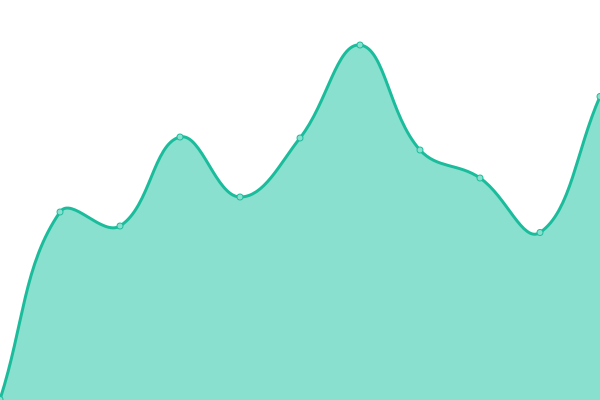 295ms
     
 | 

<a href="https://volfclub.github.io/travellings-status/history/flexiston-s-blog">89.96%</a>
    

|  [可定博客](https://wnag.com.cn) | 🟩 Up | [.yml](https://github.com/volfclub/travellings-status/commits/HEAD/history/.yml) | 

 2995ms
     
 | 

<a href="https://volfclub.github.io/travellings-status/history/">0.00%</a>
    

|  [新漫猫](https://www.acg19.top) | 🟩 Up | [.yml](https://github.com/volfclub/travellings-status/commits/HEAD/history/.yml) | 

 2995ms
     
 | 

<a href="https://volfclub.github.io/travellings-status/history/">0.00%</a>
    

|  [Paddylin的博客](https://www.paddylin.top) | 🟩 Up | [paddylin.yml](https://github.com/volfclub/travellings-status/commits/HEAD/history/paddylin.yml) | 

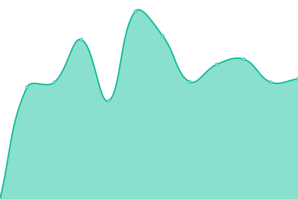 4678ms
     
 | 

<a href="https://volfclub.github.io/travellings-status/history/paddylin">100.00%</a>
    

|  [小孔成像](https://kurumit3.top) | 🟩 Up | [.yml](https://github.com/volfclub/travellings-status/commits/HEAD/history/.yml) | 

 2995ms
     
 | 

<a href="https://volfclub.github.io/travellings-status/history/">0.00%</a>
    

|  [Lime Network Blog](https://blog.limecho.net) | 🟩 Up | [lime-network-blog.yml](https://github.com/volfclub/travellings-status/commits/HEAD/history/lime-network-blog.yml) | 

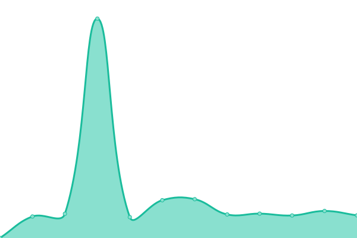 2694ms
     
 | 

<a href="https://volfclub.github.io/travellings-status/history/lime-network-blog">100.00%</a>
    

|  [Panedioic's blog](https://blog.pppane.com) | 🟩 Up | [panedioic-s-blog.yml](https://github.com/volfclub/travellings-status/commits/HEAD/history/panedioic-s-blog.yml) | 

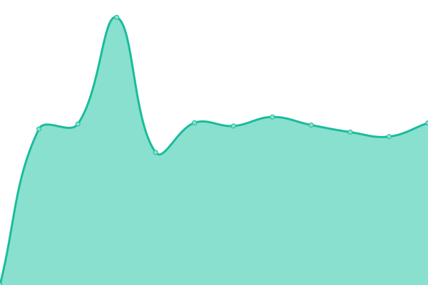 3508ms
     
 | 

<a href="https://volfclub.github.io/travellings-status/history/panedioic-s-blog">100.00%</a>
    

|  [靜海遺跡](https://voidge.cf) | 🟩 Up | [.yml](https://github.com/volfclub/travellings-status/commits/HEAD/history/.yml) | 

 2995ms
     
 | 

<a href="https://volfclub.github.io/travellings-status/history/">0.00%</a>
    

|  [风月平分破](https://www.1-365.cn) | 🟩 Up | [.yml](https://github.com/volfclub/travellings-status/commits/HEAD/history/.yml) | 

 2995ms
     
 | 

<a href="https://volfclub.github.io/travellings-status/history/">0.00%</a>
    

|  [有梦想的咸鱼](https://xianyum.cn) | 🟩 Up | [.yml](https://github.com/volfclub/travellings-status/commits/HEAD/history/.yml) | 

 2995ms
     
 | 

<a href="https://volfclub.github.io/travellings-status/history/">0.00%</a>
    

|  [大海的页面](https://ccccc.cyou) | 🟩 Up | [.yml](https://github.com/volfclub/travellings-status/commits/HEAD/history/.yml) | 

 2995ms
     
 | 

<a href="https://volfclub.github.io/travellings-status/history/">0.00%</a>
    

|  [Funix’s blog](https://www.funix.cn) | 🟥 Down | [funix-s-blog.yml](https://github.com/volfclub/travellings-status/commits/HEAD/history/funix-s-blog.yml) | 

 0ms
     
 | 

<a href="https://volfclub.github.io/travellings-status/history/funix-s-blog">0.29%</a>
    

|  [林克的编程小记](https://www.codinglink.tech) | 🟩 Up | [.yml](https://github.com/volfclub/travellings-status/commits/HEAD/history/.yml) | 

 2995ms
     
 | 

<a href="https://volfclub.github.io/travellings-status/history/">0.00%</a>
    

|  [BD的小窝](https://www.bluesdawn.top) | 🟩 Up | [bd.yml](https://github.com/volfclub/travellings-status/commits/HEAD/history/bd.yml) | 

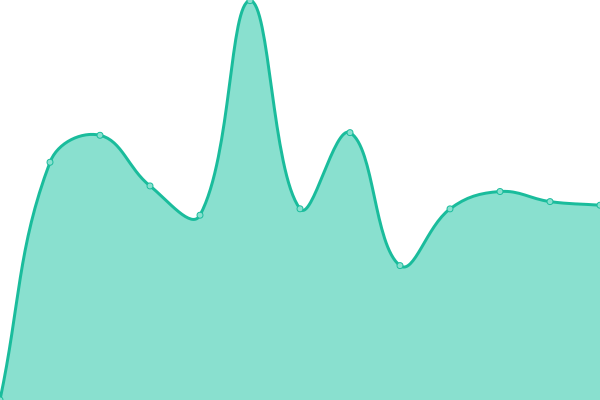 3208ms
     
 | 

<a href="https://volfclub.github.io/travellings-status/history/bd">100.00%</a>
    

|  [LBTSTO自由商店](https://www.bluesdawn.top) | 🟩 Up | [lbtsto.yml](https://github.com/volfclub/travellings-status/commits/HEAD/history/lbtsto.yml) | 

 2278ms
     
 | 

<a href="https://volfclub.github.io/travellings-status/history/lbtsto">100.00%</a>
    

|  [ChenYFanの博客](https://blog.cyfan.top) | 🟩 Up | [chen-y-fan.yml](https://github.com/volfclub/travellings-status/commits/HEAD/history/chen-y-fan.yml) | 

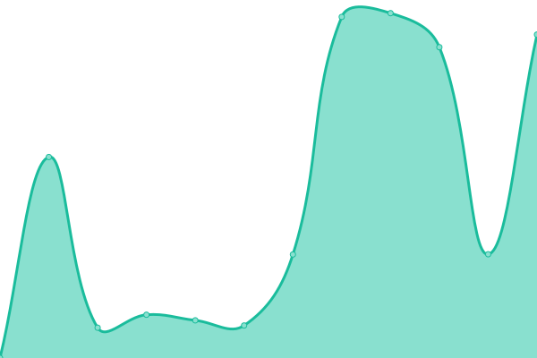 432ms
     
 | 

<a href="https://volfclub.github.io/travellings-status/history/chen-y-fan">100.00%</a>
    

|  [江风引雨の小站](https://blog.luzy.top) | 🟩 Up | [.yml](https://github.com/volfclub/travellings-status/commits/HEAD/history/.yml) | 

 2995ms
     
 | 

<a href="https://volfclub.github.io/travellings-status/history/">0.00%</a>
    

|  [Senorui's BLog](https://senorui.top) | 🟩 Up | [senorui-s-b-log.yml](https://github.com/volfclub/travellings-status/commits/HEAD/history/senorui-s-b-log.yml) | 

 577ms
     
 | 

<a href="https://volfclub.github.io/travellings-status/history/senorui-s-b-log">100.00%</a>
    

|  [神州部落格](https://www.szfc13.cn) | 🟩 Up | [.yml](https://github.com/volfclub/travellings-status/commits/HEAD/history/.yml) | 

 2995ms
     
 | 

<a href="https://volfclub.github.io/travellings-status/history/">0.00%</a>
    

|  [Declan's Blog](https://blog.lihaojin.cn) | 🟩 Up | [declan-s-blog.yml](https://github.com/volfclub/travellings-status/commits/HEAD/history/declan-s-blog.yml) | 

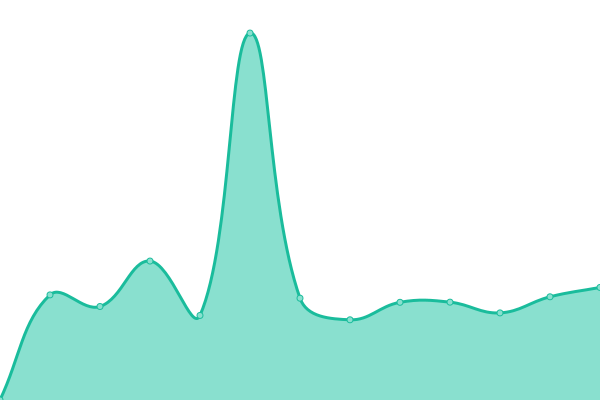 2124ms
     
 | 

<a href="https://volfclub.github.io/travellings-status/history/declan-s-blog">100.00%</a>
    

|  [鲸一](https://www.saroin.com) | 🟩 Up | [.yml](https://github.com/volfclub/travellings-status/commits/HEAD/history/.yml) | 

 2995ms
     
 | 

<a href="https://volfclub.github.io/travellings-status/history/">0.00%</a>
    

|  [JaneWu's Blog](https://zhenwu99.gitee.io) | 🟩 Up | [jane-wu-s-blog.yml](https://github.com/volfclub/travellings-status/commits/HEAD/history/jane-wu-s-blog.yml) | 

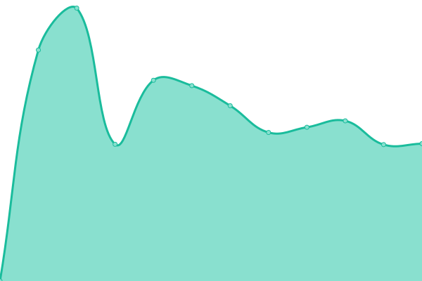 3030ms
     
 | 

<a href="https://volfclub.github.io/travellings-status/history/jane-wu-s-blog">100.00%</a>
    

|  [Zoyua's blog](https://zoyua.cn) | 🟩 Up | [zoyua-s-blog.yml](https://github.com/volfclub/travellings-status/commits/HEAD/history/zoyua-s-blog.yml) | 

 6529ms
     
 | 

<a href="https://volfclub.github.io/travellings-status/history/zoyua-s-blog">100.00%</a>
    

|  [hermoso](https://www.webpages.show) | 🟩 Up | [hermoso.yml](https://github.com/volfclub/travellings-status/commits/HEAD/history/hermoso.yml) | 

 1842ms
     
 | 

<a href="https://volfclub.github.io/travellings-status/history/hermoso">100.00%</a>
    

|  [Johnson的博客](https://johnsonlee.site) | 🟩 Up | [johnson.yml](https://github.com/volfclub/travellings-status/commits/HEAD/history/johnson.yml) | 

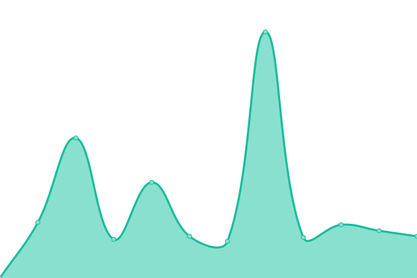 835ms
     
 | 

<a href="https://volfclub.github.io/travellings-status/history/johnson">100.00%</a>
    

|  [LeeBlog](https://www.leejean.top) | 🟩 Up | [lee-blog.yml](https://github.com/volfclub/travellings-status/commits/HEAD/history/lee-blog.yml) | 

 5920ms
     
 | 

<a href="https://volfclub.github.io/travellings-status/history/lee-blog">100.00%</a>
    

|  [Memories's home](https://blog.tedgao.com) | 🟩 Up | [memories-s-home.yml](https://github.com/volfclub/travellings-status/commits/HEAD/history/memories-s-home.yml) | 

 4402ms
     
 | 

<a href="https://volfclub.github.io/travellings-status/history/memories-s-home">100.00%</a>
    

|  [忆星辰](https://www.extingstudio.com) | 🟩 Up | [.yml](https://github.com/volfclub/travellings-status/commits/HEAD/history/.yml) | 

 2995ms
     
 | 

<a href="https://volfclub.github.io/travellings-status/history/">0.00%</a>
    

|  [YunShu'Blog](https://www.yunshu.site) | 🟩 Up | [yun-shu-blog.yml](https://github.com/volfclub/travellings-status/commits/HEAD/history/yun-shu-blog.yml) | 

 3104ms
     
 | 

<a href="https://volfclub.github.io/travellings-status/history/yun-shu-blog">100.00%</a>
    

|  [菠萝涌浆](https://www.boolo.top) | 🟩 Up | [.yml](https://github.com/volfclub/travellings-status/commits/HEAD/history/.yml) | 

 2995ms
     
 | 

<a href="https://volfclub.github.io/travellings-status/history/">0.00%</a>
    

|  [小康的个人主页](https://xiaokang.me) | 🟩 Up | [.yml](https://github.com/volfclub/travellings-status/commits/HEAD/history/.yml) | 

 2995ms
     
 | 

<a href="https://volfclub.github.io/travellings-status/history/">0.00%</a>
    

|  [威廉伯爵](https://megatontech.github.io) | 🟩 Up | [.yml](https://github.com/volfclub/travellings-status/commits/HEAD/history/.yml) | 

 2995ms
     
 | 

<a href="https://volfclub.github.io/travellings-status/history/">0.00%</a>
    

|  [hewith他和她](https://heshun.run) | 🟩 Up | [hewith.yml](https://github.com/volfclub/travellings-status/commits/HEAD/history/hewith.yml) | 

 3363ms
     
 | 

<a href="https://volfclub.github.io/travellings-status/history/hewith">100.00%</a>
    

|  [Huiris's Log](https://huiris.com) | 🟩 Up | [huiris-s-log.yml](https://github.com/volfclub/travellings-status/commits/HEAD/history/huiris-s-log.yml) | 

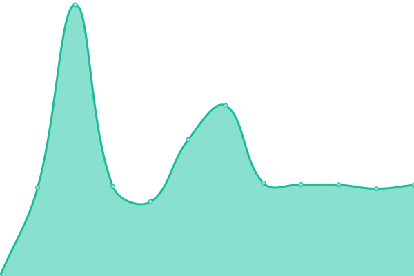 4086ms
     
 | 

<a href="https://volfclub.github.io/travellings-status/history/huiris-s-log">100.00%</a>
    

|  [iVampireSP的物语](https://ivampiresp.com) | 🟩 Up | [i-vampire-sp.yml](https://github.com/volfclub/travellings-status/commits/HEAD/history/i-vampire-sp.yml) | 

 1267ms
     
 | 

<a href="https://volfclub.github.io/travellings-status/history/i-vampire-sp">100.00%</a>
    

|  [UTOPIA](https://ishya.top) | 🟩 Up | [utopia.yml](https://github.com/volfclub/travellings-status/commits/HEAD/history/utopia.yml) | 

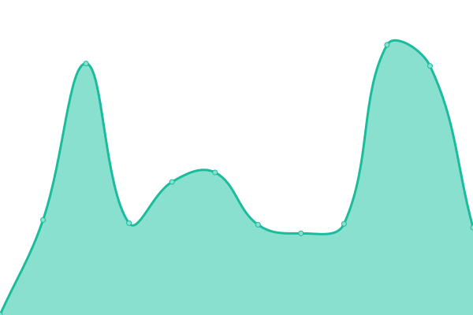 625ms
     
 | 

<a href="https://volfclub.github.io/travellings-status/history/utopia">100.00%</a>
    

|  [MBR的博客](https://blog.mbrjun.cn) | 🟩 Up | [mbr.yml](https://github.com/volfclub/travellings-status/commits/HEAD/history/mbr.yml) | 

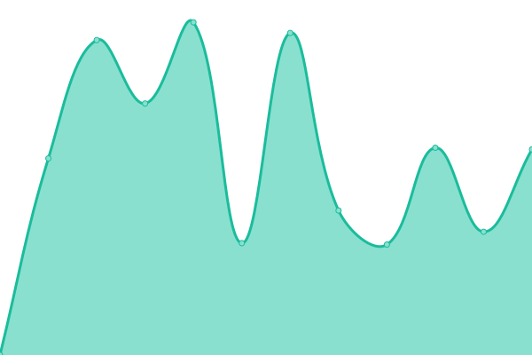 5643ms
     
 | 

<a href="https://volfclub.github.io/travellings-status/history/mbr">100.00%</a>
    

|  [阿成儿Online](https://youdef.com) | 🟩 Up | [online.yml](https://github.com/volfclub/travellings-status/commits/HEAD/history/online.yml) | 

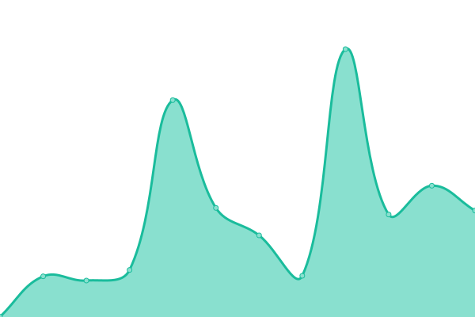 293ms
     
 | 

<a href="https://volfclub.github.io/travellings-status/history/online">100.00%</a>
    

|  [黑石博客](https://www.heson10.com) | 🟩 Up | [.yml](https://github.com/volfclub/travellings-status/commits/HEAD/history/.yml) | 

 2995ms
     
 | 

<a href="https://volfclub.github.io/travellings-status/history/">0.00%</a>
    

|  [云帆沧海](https://yunfanch.com) | 🟩 Up | [.yml](https://github.com/volfclub/travellings-status/commits/HEAD/history/.yml) | 

 2995ms
     
 | 

<a href="https://volfclub.github.io/travellings-status/history/">0.00%</a>
    

|  [wmz's blog](https://wmzwsa.xyz) | 🟩 Up | [wmz-s-blog.yml](https://github.com/volfclub/travellings-status/commits/HEAD/history/wmz-s-blog.yml) | 

 1339ms
     
 | 

<a href="https://volfclub.github.io/travellings-status/history/wmz-s-blog">100.00%</a>
    

|  [飞刀博客](https://www.feidaoboke.com) | 🟩 Up | [.yml](https://github.com/volfclub/travellings-status/commits/HEAD/history/.yml) | 

 2995ms
     
 | 

<a href="https://volfclub.github.io/travellings-status/history/">0.00%</a>
    

|  [优速VPSUR测评](https://vpsur.com) | 🟥 Down | [vpsur.yml](https://github.com/volfclub/travellings-status/commits/HEAD/history/vpsur.yml) | 

 0ms
     
 | 

<a href="https://volfclub.github.io/travellings-status/history/vpsur">1.06%</a>
    

|  [野肆的生活分享](https://yexsi.com) | 🟩 Up | [.yml](https://github.com/volfclub/travellings-status/commits/HEAD/history/.yml) | 

 2995ms
     
 | 

<a href="https://volfclub.github.io/travellings-status/history/">0.00%</a>
    

<!--end: status pages-->

[**Visit our status website →**](https://volfclub.github.io/player2)

## 📄 License

- Powered by: [Upptime](https://github.com/upptime/upptime)
- Code: [MIT](./LICENSE) © [逊狼](volf.club)
- Data in the `./history` directory: [Open Database License](https://opendatacommons.org/licenses/odbl/1-0/)
